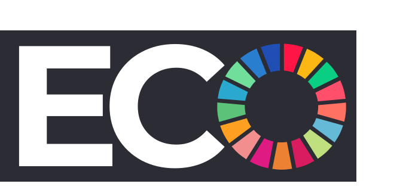

# ECOmpanion

***Your pocket guide to a sustainable life***

## Abstract

  Numerous studies show that climate change and environmental degradation is occurring at an alarming rate and unless serious reparations are made, the planet could face a mass extinction within the next century. This means that wide-spread behavioural changes on an individual level, that lead to entire societies adopting a sustainable life, are one of the essential components of the solution.

  The central idea is to create a personalized pocket guide, a one-of-its-kind solution, that initiates, monitors and develops a sustainable lifestyle for each individual user. It aims to provide a holistic approach and addresses all aspects of everyday life, apart from providing all possible conveniences that will help instate and maintain this reformed behaviour.

  ECOmpanion is a one-stop solution and the first of its kind ‘companion’ that helps make sustainable living an easy transition and maintainable reality.

## The Companion

  The Companion toolkit is a personal guide on one’s path to adopting a sustainable life.

  The core architecture of the Companion is to use flashcards to present the concept. Every flashcard in ECOmpanion is a uniquely designed page of carefully curated information. These flashcards are divided into subgroups that tackle a specific aspect of sustainable living – water, transport, food, energy, shopping choices, environmental days and miscellaneous. A flashcard has a question associated with it to facilitate a form of conversation and engage the user. The response of the user is used internally to track the progress of the user towards sustainable living.  Certain flashcards suggest habits to be inculcated by the user. Some of these habits are daily habits whereas others are occasional. The progress tracking mechanism is designed accordingly.

  A flashcard has the following hierarchy of information:
  <ol>
  <li> Tier I: Short description – This gives a brief introduction to the topic covered by the flashcard. The idea is to be as brief as possible but convey the concept to the user.</li>
  <li>Tier II: Long description – A more descriptive but relevant information is provided to the inquisitive user.</li>
  <li>Tier III: Source – If the user wants further clarification or information regarding the topic, they are directed to the authentic and detailed sources from where the data was collected.</li>
</ol>

  The Companion is equipped with certain features such as Flashcard of The Day, Daily Quiz and Reward System.

## Waste Guru
Waste Guru is another toolkit that helps the user identify the waste they have, provides appropriate awareness about its recycling possibilities and the potential damage it does to the environment, and then guides them in its safe disposal.
The primary features of the Waste Guru are:
1. Waste Identification: With a series of simple questions, we try to identify the type of waste possessed by the user. The overall algorithm covers a wide range of the possible wastes that can be generated by an individual user at home.
2. Waste Management: A variety of viable options are provided to handle the waste. If the waste cannot be handled properly at their house, they are taken to authentic third-party websites that can be contacted for handling the waste.

## Badges

Some flashcards have a badge of achievement associated with them. These badges create a system of positive reinforcement.

  
  
  
  

  
  
  
  

...and many more.

## Conclusion

  The fundamental philosophy of the app is to make sustainable living at an individual level, as far as possible within the given constraints of reality and infrastructure, a norm in society, especially among the current generation. The future for this application is to have as many components as possible of sustainable living under one heading.

## App Version
v1.4.0

## Framework
Built with Flutter.
Visit [Flutter dev](https://flutter.dev/)

App icon, in-app icons, svgs, badges and UI templates have been custom made on the platform [Figma](https://www.figma.com).
